[Read in English / Auf Englisch lesen](README.md)
***

# Projekt: Hochverfügbare 3-Tier-Architektur auf Azure
### Implementierung einer horizontal autoskalierten und sicheren Cloud-Infrastruktur mit Qualys VMDR

    
    
    
    

---

### **1. Projekt-Mission & Strategie**

Dieses Repository dokumentiert die praktische Umsetzung einer robusten, skalierbaren und sicheren 3-Tier-Anwendungsarchitektur. Das gesamte Projekt wurde auf **Microsoft Azure** aufgebaut und demonstriert Kernkompetenzen in den Bereichen Cloud Engineering, Netzwerksicherheit und automatisiertes Vulnerability Management.

---

### **2. Finale Architektur: Gebaut für Resilienz**

Im Gegensatz zu einem einfachen Proof-of-Concept wurde hier direkt eine **hochverfügbare und skalierbare Zielarchitektur** umgesetzt. Das folgende Diagramm visualisiert die gebaute Infrastruktur und den Datenfluss.

```mermaid
graph TD
    subgraph "Internet"
        User[<font size=5>💻</font><br><b>End User</b>]
    end

    subgraph "Azure Cloud (Region: East US)"
        direction TB
        subgraph "VNet: vnet-webapp-learn-eastus-001 (10.0.0.0/16)"
            direction TB
            AGW[<font size=5>🌐</font><br><b>Azure Application Gateway v2</b><br>Public Entrypoint<br>Zone-Redundant &#40;3 Zones&#41;]

            subgraph "snet-webapp (10.0.1.0/24)"
                direction LR
                Web_VMSS[<font size=4>🖥️</font><br><b>Web Tier VMSS</b><br>Ubuntu Servers<br>Auto-Scaling<br>Qualys Agent Installed]
            end

            subgraph "snet-backend (10.0.2.0/24)"
                direction LR
                Internal_LB[<font size=4>🚦</font><br><b>Internal Load Balancer</b><br>Private Access Only] --> Backend_VMSS[<font size=4>⚙️</font><br><b>Backend Tier VMSS</b><br>Ubuntu Servers<br>Auto-Scaling<br>Qualys Agent Installed]
            end
            
            style AGW fill:#D5E8D4,stroke:#82B366,stroke-width:2px
            style Web_VMSS fill:#DAE8FC,stroke:#6C8EBF,stroke-width:2px
            style Backend_VMSS fill:#DAE8FC,stroke:#6C8EBF,stroke-width:2px
            style Internal_LB fill:#FFE6CC,stroke:#D79B00,stroke-width:2px
        end
    end
    
    User -- "HTTPS &#40;Port 443&#41;" --> AGW
    AGW -- "HTTP &#40;Port 80&#41;" --> Web_VMSS
    Web_VMSS -- "API Calls &#40;Port 80&#41;" --> Internal_LB
```

---

### **3. Technische Entscheidungen: Das "Warum" hinter dem "Was"**

| Bereich | Implementierung & Begründung |
| :--- | :--- |
| **Maximale Verfügbarkeit** | **Multi-AZ-Design:** Die gesamte kritische Infrastruktur (Application Gateway, VMSS) wurde über **drei Availability Zones** verteilt. Dies gewährleistet den Betrieb auch bei Ausfall eines kompletten Rechenzentrums. |
| **Intelligente Lastverteilung** | **Duales Load Balancer-Setup:** Ein öffentliches **Application Gateway** für den Web-Traffic und ein privater **Internal Load Balancer** für den sicheren Backend-Traffic. Dieses Muster verhindert jeglichen direkten Internetzugriff auf die Anwendungs-Server. |
| **Dynamische Skalierbarkeit** | **Virtual Machine Scale Sets (VMSS):** Statt statischer VMs werden Scale Sets genutzt, um die Anzahl der Instanzen automatisch an die CPU-Last anzupassen. Das optimiert die Kosten und garantiert die Performance. |
| **Security by Design** | **Netzwerk-Isolation & NSGs:** Strikte Trennung der Tiers durch Subnetze und Network Security Groups. Die Backend-Server sind vollständig vom Internet abgeschirmt. |
| **Automatisiertes VMDR** | **Qualys Cloud Agent via VMSS-Extension:** Der Security-Agent wird bei der Erstellung **jeder einzelnen VM automatisch mitinstalliert**. Dies löst das Problem der Absicherung kurzlebiger, dynamischer Ressourcen und liefert eine lückenlose Sichtbarkeit. |

---

### **4. Lessons Learned & Business Impact**

*   **Architektur ist die erste Verteidigungslinie:** Eine gut geplante, segmentierte Architektur ist effektiver und kostengünstiger als jede nachträgliche Sicherheitsmaßnahme.
*   **Automatisierung ist der Schlüssel für Sicherheit in der Cloud:** In dynamischen Umgebungen ist manuelle Überwachung unmöglich. Nur durch automatisierte Agenten (wie Qualys) kann eine lückenlose Sicherheitsüberwachung gewährleistet werden.
*   **Redundanz ist nicht optional, sondern fundamental:** Die konsequente Nutzung von Availability Zones wandelt eine fragile Anwendung in ein robustes, ausfallsicheres System um.

---

### **Über den Autor**

**Alireza Barkesh**

Ein leidenschaftlicher und zielstrebiger Softwareentwickler mit einem starken Fokus auf Backend-Technologien und Cybersicherheit.

[Mein LinkedIn Profil](https://www.linkedin.com/in/alireza-barkesh-a0a439249) | [Mein GitHub Profil](https://github.com/barkesh)
