# Project: Highly Available 3-Tier Architecture on Azure
### A Technical Summary of a Secure and Auto-Scaled Cloud Infrastructure Build

	
	
	
	

---

## 1. Final Architecture Diagram

This diagram represents the final deployed state of the infrastructure, illustrating the three distinct tiers and the secure flow of traffic.

```mermaid
graph TD
	subgraph "Internet"
		User[💻<br><b>End User</b>]
	end

	subgraph "Azure Cloud (Region: East US)"
		direction TB
		subgraph "VNet: vnet-webapp-learn-eastus-001 (10.0.0.0/16)"
			direction TB
			AGW[🌐<br><b>Application Gateway v2</b><br>Public Entrypoint]

			subgraph "snet-webapp (10.0.1.0/24)"
				direction LR
				Web_VMSS[🖥️<br><b>Web Tier VMSS</b><br>Auto-Scaling]
			end

			subgraph "snet-backend (10.0.2.0/24)"
				direction LR
				Internal_LB[🚦<br><b>Internal Load Balancer</b>] --> Backend_VMSS[⚙️<br><b>App Tier VMSS</b><br>Auto-Scaling]
			end
            
			subgraph "snet-database (10.0.4.0/24)"
				 DB[🗄️<br><b>Azure DB for PostgreSQL</b><br>Private Access Only]
			end
		end
	end
    
	User -- "HTTPS/HTTP" --> AGW
	AGW -- "Traffic (Port 80)" --> Web_VMSS
	Web_VMSS -- "API Calls (Port 80)" --> Internal_LB
	Backend_VMSS -- "DB Queries (Port 5432)" --> DB
```

---

## 2. Core Components: The "What" and the "Why"

| Component                | Azure Service                        | Rationale ("Why?")                                                                 |
|--------------------------|--------------------------------------|-------------------------------------------------------------------------------------|
| Public Load Balancer     | Application Gateway v2               | Managed L7 load balancer, ideal for public entry. Scalable and web-specific features.|
| Web Tier Compute         | Virtual Machine Scale Set            | Auto-scaling web servers for performance and cost-efficiency.                        |
| Internal Load Balancer   | Standard Load Balancer               | Private L4 load balancer for secure internal traffic.                                |
| Application Tier Compute | Virtual Machine Scale Set            | Scalable compute for core application logic.                                         |
| Data Tier                | Azure DB for PostgreSQL              | Managed PaaS DB, VNet integration for security.                                      |
| Networking               | Virtual Network (VNet)               | Private, isolated network space in the cloud.                                        |
| Security                 | Network Security Groups (NSGs)       | Stateful firewalls enforcing communication rules.                                    |

---

## 3. Build Sequence: The "How"

The infrastructure was deployed in a logical order, from the foundational network to the final configuration of automation.

| Phase      | Step                | Action & Key Configurations                                                                 |
|------------|---------------------|-------------------------------------------------------------------------------------------|
| Foundation | VNet & Subnets      | Created VNet (10.0.0.0/16) and four /24 subnets for App Gateway, Web, Backend, Database.   |
|            | NSGs                | NSGs for Web/Backend. Rules: Internet-to-Web (443), Web-to-Backend (80), Backend-to-DB (5432).|
| Data Tier  | Subnet Delegation   | Delegated DB subnet to Microsoft.DBforPostgreSQL/flexibleServers.                         |
|            | Database Deployment | PostgreSQL Flexible Server with Private access (VNet Integration).                         |
| Backend    | Internal LB         | Standard Internal Load Balancer in backend subnet.                                         |
|            | Backend VMSS        | Ubuntu VMSS, SSH Key Auth, connected to backend subnet and LB pool.                        |
| Web Tier   | Application Gateway | App Gateway in dedicated subnet with new Public IP.                                        |
|            | Routing Rule        | Listener (port 80), Backend Pool, Backend Setting.                                         |
|            | Web VMSS            | VMSS for web servers, connected to web subnet and App Gateway backend pool.                |
| Automation | Autoscale Rules     | Custom autoscale on both VMSS: Scale out >75%, Scale in <25%, min 2 instances.            |

---

## 4. Troubleshooting & Real-World Lessons

**Issue 1: OverconstrainedZonalAllocationRequest**
- *Problem*: VMSS deployment failed due to lack of physical capacity in all requested Availability Zones.
- *Solution*: Changed VM family and removed zone constraint to ensure deployment.

**Issue 2: ProvisionNotSupportedForRegion**
- *Problem*: MySQL DB deployment failed due to region/service availability.
- *Solution*: Switched to PostgreSQL, which was available.

**Issue 3: MissingSubscriptionRegistration**
- *Problem*: Autoscale settings failed due to unregistered microsoft.insights Resource Provider.
- *Solution*: Manually registered the provider in subscription settings.

---

## 5. Final Status & Next Steps

- **Status**: 3-tier infrastructure is 100% deployed and configured.
- **Validation**: Test to App Gateway's public IP returned 502 Bad Gateway (network path working, web servers lack app).

**Next Steps:**
- Infrastructure as Code (IaC): Rebuild using Terraform.
- CI/CD: Create GitHub Actions pipeline to deploy application code.

---

## About the Author
**Alireza Barkesh**

A passionate and goal-oriented software developer focused on backend technologies and cybersecurity. Pursuing deep expertise at the intersection of secure software development and modern cloud infrastructure.

[My LinkedIn Profile](#)

