[Read in German / Auf Deutsch lesen](README-de.md)
***

# Project: Highly Available 3-Tier Architecture on Azure  
### Implementing a Horizontally Auto-Scaled and Secure Cloud Infrastructure with Qualys VMDR

    
    
    
    

---

### **1. Project Mission & Strategy**

This repository documents the practical implementation of a robust, scalable, and secure 3-tier application architecture. The entire project was built on **Microsoft Azure** and demonstrates core competencies in **Cloud Engineering**, **Network Security**, and **Automated Vulnerability Management**.

> **Goal:** Not just to understand theoretical concepts but to master them in practice. This project is a key milestone in my **3-Year Learning Roadmap (Backend, Security, LLMs)**, which started on April 28, 2025.

---

### **2. Final Architecture: Built for Resilience**

Unlike a simple proof-of-concept, this project implements a **production-grade, highly available, and auto-scalable target architecture**. The following diagram visualizes the deployed infrastructure and data flow.

```mermaid
graph TD
    subgraph "Internet"
        User[<font size=5>💻</font><br><b>End User</b>]
    end

    subgraph "Azure Cloud (Region: East US)"
        direction TB
        subgraph "VNet: vnet-webapp-learn-eastus-001 (10.0.0.0/16)"
            direction TB
            AGW[<font size=5>🌐</font><br><b>Azure Application Gateway v2</b><br>Public Entrypoint<br>Zone-Redundant &#40;3 Zones&#41;]

            subgraph "snet-webapp (10.0.1.0/24)"
                direction LR
                Web_VMSS[<font size=4>🖥️</font><br><b>Web Tier VMSS</b><br>Ubuntu Servers<br>Auto-Scaling<br>Qualys Agent Installed]
            end

            subgraph "snet-backend (10.0.2.0/24)"
                direction LR
                Internal_LB[<font size=4>🚦</font><br><b>Internal Load Balancer</b><br>Private Access Only] --> Backend_VMSS[<font size=4>⚙️</font><br><b>Backend Tier VMSS</b><br>Ubuntu Servers<br>Auto-Scaling<br>Qualys Agent Installed]
            end
            
            style AGW fill:#D5E8D4,stroke:#82B366,stroke-width:2px
            style Web_VMSS fill:#DAE8FC,stroke:#6C8EBF,stroke-width:2px
            style Backend_VMSS fill:#DAE8FC,stroke:#6C8EBF,stroke-width:2px
            style Internal_LB fill:#FFE6CC,stroke:#D79B00,stroke-width:2px
        end
    end
    
    User -- "HTTPS &#40;Port 443&#41;" --> AGW
    AGW -- "HTTP &#40;Port 80&#41;" --> Web_VMSS
    Web_VMSS -- "API Calls &#40;Port 80&#41;" --> Internal_LB
```

---

### **3. Technical Decisions: The "Why" Behind the "What"**

| Area | Implementation & Rationale |
| :--- | :--- |
| **High Availability** | **Multi-AZ Design:** All critical infrastructure (Application Gateway, VMSS) is deployed across **three Availability Zones**. This ensures operation even in the event of a complete datacenter outage. |
| **Smart Traffic Distribution** | **Dual Load Balancer Setup:** A public **Application Gateway** handles web traffic, while a private **Internal Load Balancer** secures backend traffic. This prevents any direct internet access to application servers. |
| **Dynamic Scalability** | **Virtual Machine Scale Sets (VMSS):** Instead of static VMs, scale sets are used to automatically adjust the number of instances based on CPU load, optimizing cost and ensuring performance. |
| **Security by Design** | **Network Isolation & NSGs:** Strict separation of tiers using subnets and Network Security Groups. Backend servers are completely isolated from the internet. |
| **Automated VMDR** | **Qualys Cloud Agent via VMSS Extension:** The security agent is automatically installed on every VM instance during creation. This ensures continuous security visibility even for short-lived, dynamic resources. |

---

### **4. Lessons Learned & Business Impact**

*   **Architecture is the first line of defense:** A well-planned, segmented architecture is more effective and cost-efficient than any reactive security patch.  
*   **Automation is key to cloud security:** In dynamic environments, manual oversight is impossible. Automated agents like Qualys ensure continuous security monitoring.  
*   **Redundancy is not optional:** Leveraging Availability Zones transforms a fragile application into a resilient, fault-tolerant system.  

---

### **5. Project Roadmap: From Manual to Automated**

This project serves as a strong foundation. The next logical evolution steps are:

-   [x] **Phase 1: Manual Setup & Validation (Completed)**  
    -   Built the entire infrastructure via Azure Portal.  
    -   Validated network rules, load balancers, and auto-scaling through load tests.  
    -   Integrated and validated the Qualys Cloud Agent.

-   [ ] **Phase 2: Infrastructure as Code (IaC)**  
    -   **Goal:** Migrate the entire setup to **Terraform**.  
    -   **Benefit:** Full automation, version control, and reproducibility — the industry standard.

-   [ ] **Phase 3: DevSecOps & CI/CD**  
    -   **Goal:** Implement a **GitHub Actions pipeline** to automatically deploy new application versions to VMSS on code push.  
    -   **Benefit:** “Shift Left” by integrating security scans (e.g., container scans) directly into the pipeline, detecting vulnerabilities before production.

-   [ ] **Phase 4: LLM Integration**  
    -   **Goal:** Deploy a simple Python API on the app tier that uses an LLM for a specific task.  
    -   **Benefit:** Connecting all three pillars of my learning roadmap in one practical project.

---

### **About the Author**

**Alireza Barkesh**  

A passionate and goal-oriented software developer with a strong focus on backend technologies and cybersecurity. I am actively pursuing a challenging 3-year learning roadmap to gain deep expertise at the intersection of secure software development and modern cloud infrastructure.

[My LinkedIn Profile](https://www.linkedin.com/in/alireza-barkesh-a0a439249) | [My GitHub Profile](https://github.com/barkesh)
